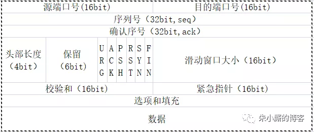
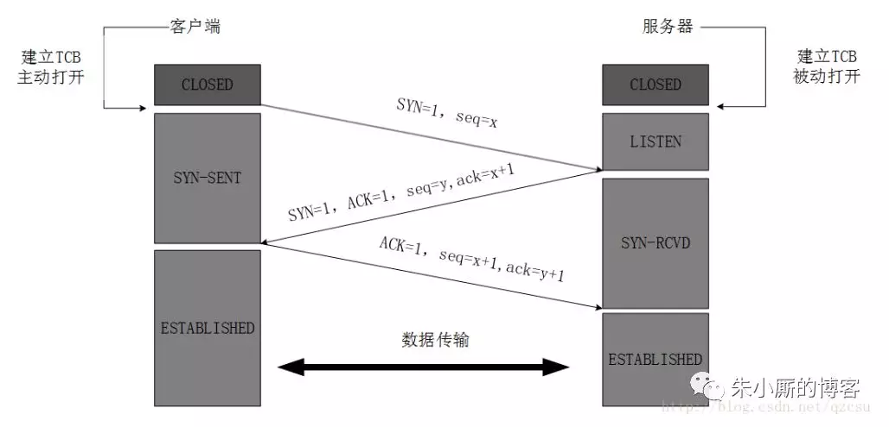
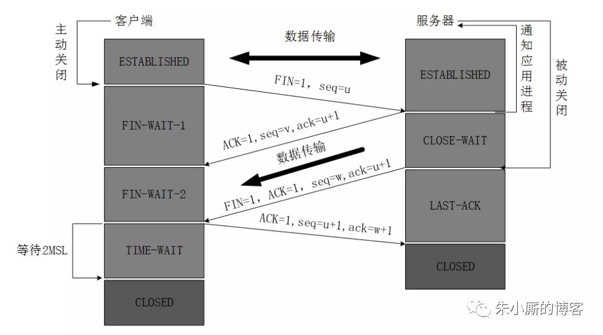
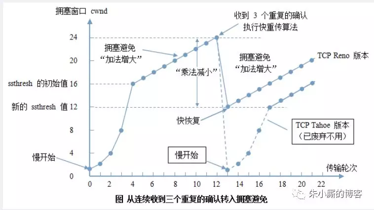

# 3. TCP协议

### **TCP报文结构**

- 标志位
    - URG
        ```
        指示报文中有紧急数据，应尽快传送（相当于高优先级的数据）。
        ```
    - PSH
        ```
        为1表示是带有push标志的数据，指示接收方在接收到该报文段以后，应尽快将这个报文段交给应用程序，而不是在缓冲区排队。
        ```
    - RST
        ```
        TCP连接中出现严重差错（如主机崩溃），必须释放连接，在重新建立连接。
        ```
    - FIN
        ```
        发送端已完成数据传输，请求释放连接
        ```
    - SYN
        ```
        处于TCP连接建立过程.（Synchronize Sequence Numbers）
        ```
    - ACK
        ```
        确认序号标志，为1时表示确认号有效，为0表示报文中不含确认信息，忽略确认号字段
        ```
- 滑动窗口
    - 滑动窗口大小
        ```
        接收端用来告知发送端：自己还有多少缓冲区可以接收数据
        发送端根据窗口大小发送数据，从而达到流量控制，最大为65535
        ```
- 头部长度
    ```
    表示TCP报文段中数据不分在整个TCP报文段中的位置
    ```
    
### **三次握手**

- 1 
    ```
    TCP服务器进程先创建传输控制块TCB，时刻准备接受客户进程的连接请求，此时服务器就进入了LISTEN（监听）状态；
    ```
- 2
    ```
    TCP客户进程也是先创建传输控制块TCB，然后向服务器发出连接请求报文，这是报文首部中的**同部位SYN=1，同时选择一个初始序列号 seq=x **，此时，TCP客户端进程进入了 SYN-SENT（同步已发送状态）状态。TCP规定，SYN报文段（SYN=1的报文段）不能携带数据，但需要消耗掉一个序号。
    ```
- 3
    ```
    TCP服务器收到请求报文后，如果同意连接，则发出确认报文。确认报文中应该 ACK=1，SYN=1，确认号是ack=x+1，同时也要为自己初始化一个序列号 seq=y，此时，TCP服务器进程进入了SYN-RCVD（同步收到）状态。这个报文也不能携带数据，但是同样要消耗一个序号。
    ```
- 4
    ```
    TCP客户进程收到确认后，还要向服务器给出确认。确认报文的ACK=1，ack=y+1，自己的序列号seq=x+1，此时，TCP连接建立，客户端进入ESTABLISHED（已建立连接）状态。TCP规定，ACK报文段可以携带数据，但是如果不携带数据则不消耗序号。
    ```
- 5
    ```
    当服务器收到客户端的确认后也进入ESTABLISHED状态，此后双方就可以开始通信了。
    ```
#### DOS/DDOS攻击
- 攻击方式
```

```
- 解决方案
```

```
### **四次挥手**

- 1
    ```
    客户端进程发出连接释放报文，并且停止发送数据。释放数据报文首部，FIN=1，其序列号为seq=u（等于前面已经传送过来的数据的最后一个字节的序号加1），此时，客户端进入FIN-WAIT-1（终止等待1）状态。 TCP规定，FIN报文段即使不携带数据，也要消耗一个序号。
    ```
- 2
    ```
    服务器收到连接释放报文，发出确认报文，ACK=1，ack=u+1，并且带上自己的序列号seq=v，此时，服务端就进入了CLOSE-WAIT（关闭等待）状态。TCP服务器通知高层的应用进程，客户端向服务器的方向就释放了，这时候处于半关闭状态，即客户端已经没有数据要发送了，但是服务器若发送数据，客户端依然要接受。这个状态还要持续一段时间，也就是整个CLOSE-WAIT状态持续的时间。
    ```
- 3
    ```
    客户端收到服务器的确认请求后，此时，客户端就进入FIN-WAIT-2（终止等待2）状态，等待服务器发送连接释放报文（在这之前还需要接受服务器发送的最后的数据）。
    ```
- 4
    ```
    服务器将最后的数据发送完毕后，就向客户端发送连接释放报文，FIN=1，ack=u+1，由于在半关闭状态，服务器很可能又发送了一些数据，假定此时的序列号为seq=w，此时，服务器就进入了LAST-ACK（最后确认）状态，等待客户端的确认。
    ```
- 5
    ```
    客户端收到服务器的连接释放报文后，必须发出确认，ACK=1，ack=w+1，而自己的序列号是seq=u+1，此时，客户端就进入了TIME-WAIT（时间等待）状态。注意此时TCP连接还没有释放，必须经过2MSL（最长报文段寿命）的时间后，当客户端撤销相应的TCB后，才进入CLOSED状态。
    ```
- 6
    ```
    服务器只要收到了客户端发出的确认，立即进入CLOSED状态。同样，撤销TCB后，就结束了这次的TCP连接。可以看到，服务器结束TCP连接的时间要比客户端早一些。
    ```
#### TIME_WAIT等待2MSL
- 保证客户端发送的最后一个ack到达服务器
- 等待所有网络中的报文传输完成

### **拥塞控制**

- cwnd：发送端窗口( congestion window )
- rwnd：接收端窗口（receiver window）
- 发送端主动控制rwnd
    - 慢开始：rwnd从1开始指数增长
    - 到门限值ssthresh：拥塞控制算法（线性增长）
    - 超时 ssthresh和cwnd均设为当前rwnd的1/2，重复第二步
    
# 参考文献：https://mp.weixin.qq.com/s/HLOMQ6L-0HVFzlF6oncYcA