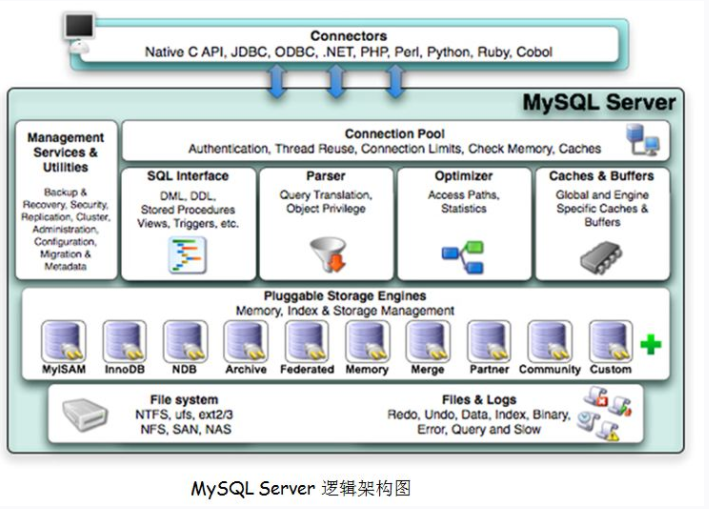

# 4. mysql剖析
### a.**mysql逻辑架构**

### b.**sql执行过程**
- 程序通过Connectors（链接器）连接到mysql `认证` `授权` `连接`
- mysql将连接放入Connection Pool（连接池），并交由Management Services & Utilities（控制器）管理
- 管理器将请求交给SQL Interface（SQL接口），SQL Interface对sql进行hash并与Cache & Buffer（缓存）中结果对比，匹配直接返回结果，未匹配则继续
- SQL Interface 交给 Parser（解释器），验证sql正确性，转化为规范数据结构
- Optimizer（优化器）分析sql产生最优执行方案
- Storage Engine（存储引擎）执行sql，从File System（文件系统）中检索到数据并返回，同时对sql进行hash缓存一份结果到Cache & Buffer中。
- 如果是修改操作则添加一份Files & Logs信息
### c. **InnoDB执行过程**
    
### d. **本地事务**

### e. **分布式事务**
    

